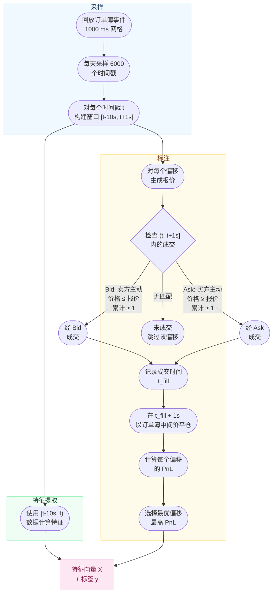
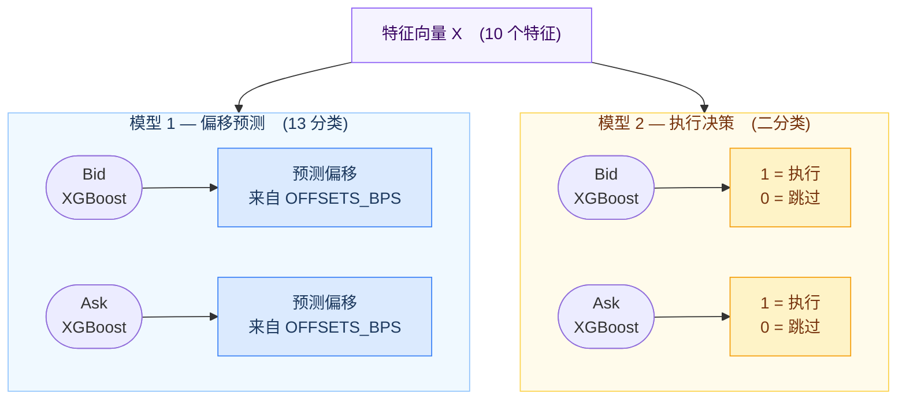
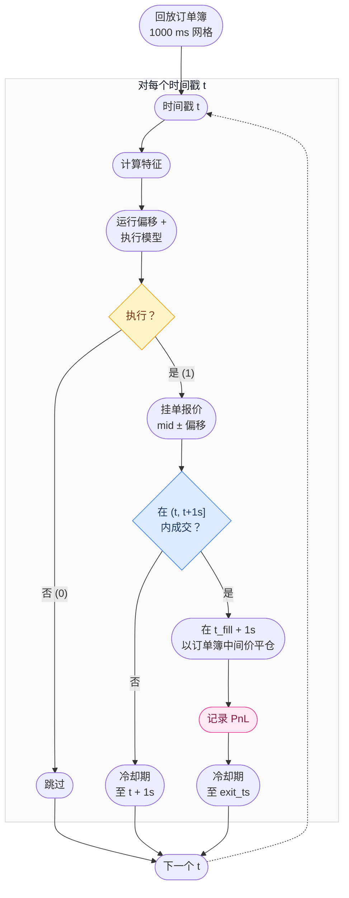
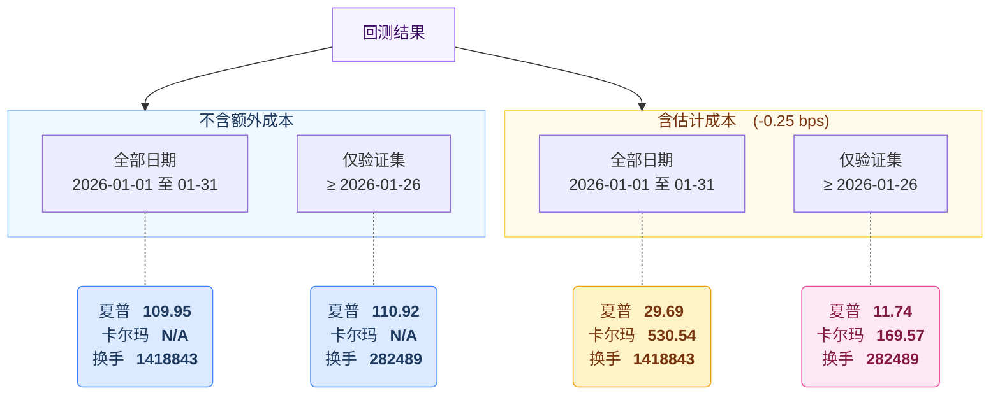

<div align="right">

**EN** [English](README_E.md) &nbsp;|&nbsp; **中文** [简体中文](README.md)
<br>
<sub>注：部分专业术语在中文版中可能不够精确，建议对照 <a href="README_E.md">英文版</a> 参考。如有疑问欢迎随时联系我。</sub>
</div>

<div align="center">

# BTC-USDT-SWAP 做市回测项目

*基于机器学习的 BTC-USDT-SWAP 做市策略，*
*优化报价偏移选择与执行决策。*

<br>

**目标** &nbsp;&bull;&nbsp; 做市策略 &nbsp;|&nbsp; 返佣 **-0.5 bps** &nbsp;|&nbsp; 换手率 **> 500x/月** &nbsp;|&nbsp; BTC-USDT-SWAP &nbsp;|&nbsp; 2026年1月

</div>

<br>

## 项目概览


| 步骤 | 脚本 | 描述 |
|:----:|--------|-------------|
| **1** | `step1.py` | 订单簿回放、特征提取、成交模拟、标注数据集 |
| **2** | `step2_1.py` `step2_2.py` `step2_3.py` | 训练 XGBoost 模型（偏移分类器、回归器、执行分类器） |
| **3** | `step3.py` | 使用训练好的模型对历史数据进行完整回测 |
| **4** | `step4.ipynb` | 策略评估（夏普比率、卡尔玛比率） |

---

## 数据

31 天逐笔级别的 BTC-USDT-SWAP 数据（2026-01-01 至 2026-01-31）：

| 来源 | 格式 | 内容 |
|--------|--------|---------|
| **订单簿** | `BTC-USDT-SWAP-L2orderbook-400lv-YYYY-MM-DD.data` | 400 Levels Order Book Data |
| **成交数据** | `BTC-USDT-SWAP-trades-YYYY-MM-DD.csv` | 逐笔成交记录 |

<details>
<summary><b>数据缺失项</b></summary>
<br>

数据集仅包含订单簿和成交数据。缺失的关键信息包括：

- 队列位置与订单优先级
- 延迟与网络延时信息
- 更广泛的市场背景（指数价格、跨资产相关性）
- 参与者身份与订单 ID
- 订单到达率与撤单模式

鉴于这些限制，本项目并非复制完整的做市策略，而是从可用数据中提取最重要的信号，并将其嵌入基于机器学习的项目中。

</details>

---

## 步骤一 &mdash; 特征选择与数据项目

### 特征 (X)

| 特征 | 类别 | 描述 |
|:--------|:--------:|-------------|
| `OBI5` | 方向性 | 订单簿失衡 &mdash; 前 5 档 |
| `OBI25` | 方向性 | 订单簿失衡 &mdash; 前 25 档 |
| `OBI400` | 方向性 | 订单簿失衡 &mdash; 全部 400 档 |
| `NTR_10s` | 波动性 | 10 秒窗口内的归一化真实波幅（bps） |
| `mid_std_2s` | 波动性 | [t-2s, t] 内所有订单簿事件中间价的总体标准差 |
| `spread_bps` | 流动性 | 最优买卖价差（基点） |
| `trade_flow_10s` | 方向性 | 10 秒内的净签名成交量 |
| `trade_count_10s` | 活跃度 | 10 秒窗口内的成交笔数 |
| `cumulativeVolume_5bps` | 流动性 | 中间价 5 bps 范围内的订单簿累计深度 |
| `hour_of_day` | 时间性 | UTC 小时 &mdash; 日内季节性效应 |

### 标签 (y)

从离散集合中选取的距中间价的**最优基点偏移**：

```
OFFSETS_BPS = (0.0, 0.1, 0.2, 0.3, 0.4, 0.5, 0.6, 0.7, 0.8, 0.9, 1.0, 1.2, 1.25)
```

对于每个候选偏移，项目模拟成交尝试和平仓，然后选择使 PnL 最大化的偏移。此标注步骤使用未来数据（\[t, t + 1s\] 内的成交数据和 t\_fill + 1s 时刻的订单簿）来构建真实标签。

### 假设条件

| 假设 | 值 |
|:-----------|:------|
| 延迟 | 0 ms |
| 交易规模 | 1 单位 BTC-USDT-SWAP |
| 跨交易所效应 | 无 |
| 库存成本 | 无 |
| 队列位置 | 忽略 |
| 初始资金 | 1 单位 BTC-USDT-SWAP |
| 平仓规则 | 在 t\_fill + 1s 时以订单簿中间价平仓 |
| 部分成交 | 不允许 |
| 成交价格 | 以挂单报价成交 |
| 交易手续费 | 无 |

### 数据项目



> **报价公式：**
> | 方向 | 公式 |
> |:-----|:--------|
> | Bid（买） | `mid * (1 - offset_bps / 10000)` |
> | Ask（卖） | `mid * (1 + offset_bps / 10000)` |

---

## 步骤二 &mdash; 机器学习

### 共线性分析

训练前对特征共线性进行了检验：

1. **OBI5 / OBI25 / OBI400** &mdash; 中高共线性，但并非冗余。每个特征捕捉不同深度的订单簿失衡：OBI5 反映即时微观结构压力，OBI25 捕捉近盘口情绪，OBI400 揭示全深度方向性偏差。更深层级噪声更大但更稳定。

2. **spread_bps 与 cumulativeVolume_5bps** &mdash; 中等共线性。两者均衡量流动性，但价差捕捉的是即时性成本（最优买卖价差），而累计深度衡量的是中间价附近可用的深度。窄价差薄深度与窄价差厚深度具有截然不同的含义。

3. **NTR_10s 与 mid_std_2s** &mdash; 中等共线性。两者均捕捉短期波动性，但 NTR 使用 10 秒内的成交价格（真实波幅 / 中间价），而 mid_std 使用 2 秒内的订单簿中间价波动。NTR 反映实际交易的已实现波动率；mid_std 捕捉报价层面的微观结构噪声。

尽管存在相关性，所有特征均予以保留 &mdash; XGBoost 基于树的分裂能够很好地处理共线性，且每个特征在不同粒度上提供互补信息。

### 模型选择

由于项目目标是基于观测特征预测交易决策（执行与报价偏移），**判别式建模**方法是合适的，因为它直接建模条件关系 P(y | x)。

虽然底层市场数据本质上是序列性的，但特征工程过程将历史信息聚合为每个决策时间戳的定长特征向量。因此，问题被有效转化为**表格型监督学习**任务，而非序列建模问题。

虽然 LSTM 等序列模型可能捕捉更丰富的时间依赖关系，但它们需要更多的数据和计算资源。考虑到时间限制以及树模型在表格数据上的优异表现，本项目选择 **XGBoost** 作为模型。

### 模型架构



> **训练 / 验证集划分：** 日期 &le; 2026-01-25 用于训练 &nbsp;|&nbsp; 日期 &ge; 2026-01-26 用于验证

---

## 步骤三 &mdash; 回测



**关键规则：**

| 规则 | 详情 |
|:-----|:-------|
| **单边冷却期** | 同一方向不允许重叠持仓。成交后锁定至平仓；未成交则锁定至报价窗口到期。 |
| **双边同时活跃** | Bid 和 Ask 独立运作。永续合约保证金下，最大方向性敞口 = 1 单位。 |
| **单次遍历回放** | 一次订单簿回放同时处理双边，高效运行。 |

---

## 步骤四 &mdash; 结果分析



### 分析

**为什么夏普比率极高？**

偏移模型绝大多数情况下预测偏移 = 0（99.1% 的已成交交易），这意味着策略实际上在中间价处报价。在偏移 = 0 时，成交率很高，且当价格在 1 秒内未发生不利变动时，每笔交易大约赚取做市商返佣（0.5 bps）。具体表现为：

- **63.3%** 的已成交交易恰好赚取 0.5 bps（纯返佣）
- **每一天**均为盈利（日均范围：0.19 &ndash; 0.45 bps）
- **极低的日间方差**（日标准差 &asymp; 0.06 bps）

$$\text{Sharpe} = \frac{\mu}{\sigma} \times \sqrt{365} = \frac{0.34}{0.06} \times 19.1 \approx 110$$

比率之所以高，并非因为卓越的 alpha，而是因为该策略是一个近乎确定性的返佣收集器，方差极小。

**为什么不含成本时卡尔玛为 N/A？**

$$\text{Calmar} = \frac{\text{年化收益率}}{\text{最大回撤}}$$

由于不含成本时每天都盈利，净值曲线单调递增 &mdash; 最大回撤为零，卡尔玛无定义。

**为什么添加成本很重要？**

保守估计每笔交易 **0.25 bps** 的成本，用于涵盖回测中未建模的真实世界摩擦（队列优先级 / 逆向选择、库存风险、基础设施延迟）。扣除成本后，每笔交易的平均 PnL 从约 0.34 降至约 0.09 bps，产生亏损日和非零回撤 &mdash; 从而得到有意义的夏普和卡尔玛数值。

**样本内 vs. 样本外**

模型使用日期 &le; 2026-01-25 的数据训练。含成本的结果对比：

| | 全部日期 *（含训练期）* | 仅验证集 *（&ge; 01-26）* | 变化 |
|:--|:-:|:-:|:-:|
| **夏普** | 29.69 | 11.74 | &minus;60% |
| **卡尔玛** | 530.54 | 169.57 | &minus;68% |

夏普在样本外数据上从 29.69 降至 11.74，表明训练期存在一定程度的过拟合。验证期表现出更低的平均收益和更高的波动性，因为模型遇到了训练集中未包含的市场状况。尽管有所下降，策略在未见数据上仍保持盈利，表明核心信号（低波动率条件下的返佣收集）持续存在 &mdash; 但优势远弱于样本内指标所示。

---

## 附录

<details>
<summary><b>A. 特征公式</b></summary>
<br>

**订单簿失衡 (OBI)**

$$\text{OBI}_n = \frac{B_n - A_n}{B_n + A_n}$$

> 其中 $B_n = \sum_{i=1}^{n} b_i$（第 *i* 档买方挂单量），$A_n = \sum_{i=1}^{n} a_i$（第 *i* 档卖方挂单量）

**归一化真实波幅 (NTR, 10 s)**

$$\text{TR} = \max\bigl(H - L, \; \lvert H - C_{\text{prev}}\rvert, \; \lvert L - C_{\text{prev}}\rvert\bigr)$$

$$\text{NTR} = \frac{\text{TR}}{M} \times 10000 \;\text{ (bps)}$$

> 其中 *H*、*L* = 10 秒窗口内的最高/最低成交价，*C*<sub>prev</sub> = 窗口前的最后一笔成交价，*M* = 中间价

**中间价标准差 (2 s)**

$$\sigma_{\text{mid}} = \sqrt{\frac{1}{N} \sum_{i=1}^{N} (m_i - \bar{m})^{2}}$$

> [t &minus; 2s, t] 内所有订单簿事件中间价的总体标准差

**价差 (bps)**

$$S = \frac{P_{\text{ask}} - P_{\text{bid}}}{M} \times 10000$$

**成交流量 (10 s)**

$$F = \sum_{i \in [t-10s, \; t)} d_i \cdot v_i$$

> 其中 *d* = +1（买方主动成交）或 &minus;1（卖方主动成交），*v* = 成交量

**累计深度 (5 bps)**

$$V_{5} = \sum_{\text{bid levels} \leq 5\text{bps}} v_i \;+\; \sum_{\text{ask levels} \leq 5\text{bps}} v_i$$

</details>

<details>
<summary><b>B. 成交逻辑</b></summary>
<br>

| 条件 | Bid（买方） | Ask（卖方） |
|:----------|:---------|:---------|
| **主动方** | 卖方主动成交 (sign = &minus;1) | 买方主动成交 (sign = +1) |
| **价格** | 成交价 &le; 买方报价 | 成交价 &ge; 卖方报价 |
| **数量** | 累计成交量 &ge; 1 单位 | 累计成交量 &ge; 1 单位 |
| **窗口** | (t, t + 1s] | (t, t + 1s] |

</details>

<details>
<summary><b>C. PnL 公式</b></summary>
<br>

| 方向 | 公式 |
|:-----|:--------|
| **Bid（买）** | pnl\_bps = 0.5 + (exit\_mid &minus; entry\_price) / entry\_mid &times; 10000 |
| **Ask（卖）** | pnl\_bps = 0.5 + (entry\_price &minus; exit\_mid) / entry\_mid &times; 10000 |

- **0.5** = 做市商返佣（bps）
- **entry\_price** = 报价（mid &plusmn; 偏移）
- **entry\_mid** = 报价时刻 *t* 的订单簿中间价
- **exit\_mid** = *t*\_fill + 1s 时刻的订单簿中间价

</details>

<details>
<summary><b>D. 平仓逻辑</b></summary>
<br>

在 t\_fill + 1s **之后（含）记录的第一个订单簿中间价**处平仓。头寸以此理论公允价格平仓（假设可在中间价即时执行）。

</details>

<details>
<summary><b>E. 项目结构</b></summary>
<br>

```
project_intern/
├── code/
│   ├── step1.py                  # 数据项目与标注
│   ├── step2_1.py                # 偏移分类器训练
│   ├── step2_2.py                # 偏移回归器训练（备选）
│   ├── step2_3.py                # 执行分类器训练
│   ├── step3.py                  # 回测引擎
│   ├── step4.ipynb               # 结果评估
│   ├── tools.py                  # 工具函数
│   └── *.json                    # 训练好的 XGBoost 模型
```

</details>

<details>
<summary><b>F. 依赖</b></summary>
<br>

- Python 3.8+
- XGBoost
- pandas
- NumPy
- scikit-learn
- PyArrow

</details>
