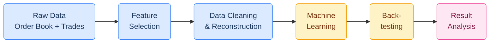
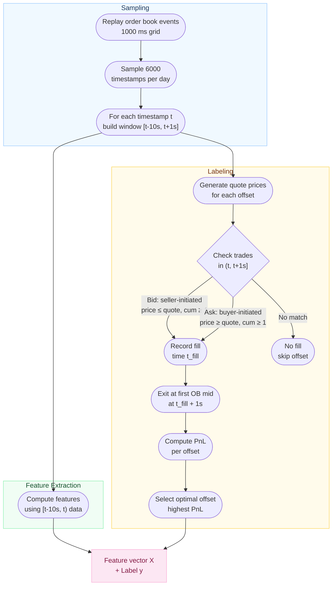
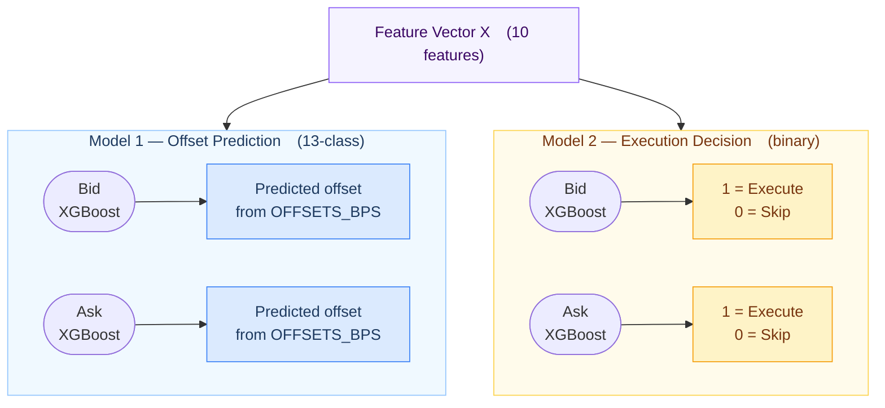
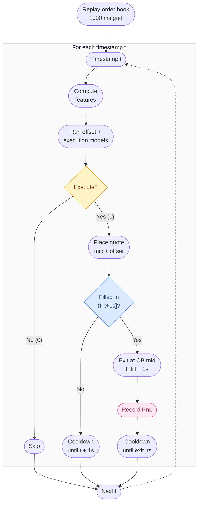
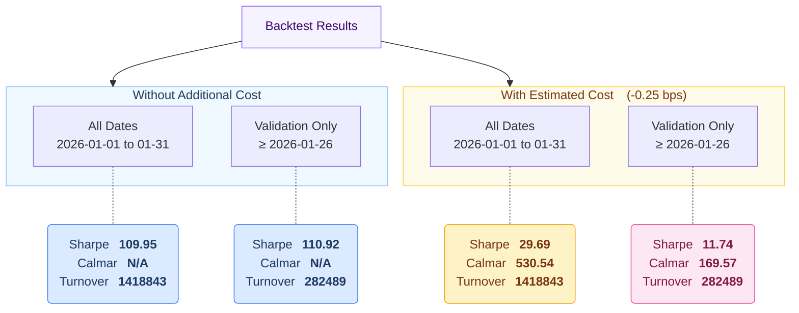

<div align="right">

**EN** [English](README_E.md) &nbsp;|&nbsp; **中文** [简体中文](README.md)

</div>

<div align="center">

# BTC-USDT-SWAP Market-Making Backtest Pipeline

*A machine-learning-driven market-making strategy for BTC-USDT-SWAP perpetual swaps,*
*optimizing quote offset selection and execution decisions.*

<br>

**Goal** &nbsp;&bull;&nbsp; Maker strategy &nbsp;|&nbsp; Rebate **-0.5 bps** &nbsp;|&nbsp; Turnover **> 500x/month** &nbsp;|&nbsp; BTC-USDT-SWAP &nbsp;|&nbsp; January 2026

</div>

<br>

## Pipeline Overview



| Step | Script | Description |
|:----:|--------|-------------|
| **1** | `step1.py` | Order book replay, feature extraction, fill simulation, labeled dataset |
| **2** | `step2_1.py` `step2_2.py` `step2_3.py` | Train XGBoost models (offset classifier, regressor, execution classifier) |
| **3** | `step3.py` | Full backtest with trained models on historical data |
| **4** | `step4.ipynb` | Strategy evaluation (Sharpe ratio, Calmar ratio) |

---

## Data

31 days of tick-level BTC-USDT-SWAP data (2026-01-01 to 2026-01-31):

| Source | Format | Content |
|--------|--------|---------|
| **Order Book** | `BTC-USDT-SWAP-L2orderbook-400lv-YYYY-MM-DD.data` | 400-level L2 snapshots + incremental updates |
| **Trades** | `BTC-USDT-SWAP-trades-YYYY-MM-DD.csv` | Tick-by-tick trade records with aggressor side |

<details>
<summary><b>What the data lacks</b></summary>
<br>

The dataset is limited to order book and trade data only. Key information missing includes:

- Queue position and order priority
- Latency and network delay information
- Broader market context (index prices, cross-asset correlations)
- Participant identity and order IDs
- Order arrival rates and cancellation patterns

Given these limitations, rather than replicating a full market-maker strategy, this project focuses on extracting the most important signals from the available data and embedding them into an ML-driven pipeline.

</details>

---

## Step 1 &mdash; Feature Selection & Data Pipeline

### Features (X)

| Feature | Category | Description |
|:--------|:--------:|-------------|
| `OBI5` | Directional | Order Book Imbalance &mdash; top 5 levels |
| `OBI25` | Directional | Order Book Imbalance &mdash; top 25 levels |
| `OBI400` | Directional | Order Book Imbalance &mdash; all 400 levels |
| `NTR_10s` | Volatility | Normalized True Range over 10 s window (bps) |
| `mid_std_2s` | Volatility | Population std of all OB event mids in [t - 2s, t] |
| `spread_bps` | Liquidity | Best-bid / best-ask spread in basis points |
| `trade_flow_10s` | Directional | Net signed trade volume over 10 s |
| `trade_count_10s` | Activity | Number of trades in the 10 s window |
| `cumulativeVolume_5bps` | Liquidity | Order book depth within 5 bps of mid |
| `hour_of_day` | Temporal | Hour of day (UTC) &mdash; intraday seasonality |

### Label (y)

The **optimal basis-point offset** from the mid price, selected from a discrete set:

```
OFFSETS_BPS = (0.0, 0.1, 0.2, 0.3, 0.4, 0.5, 0.6, 0.7, 0.8, 0.9, 1.0, 1.2, 1.25)
```

For each candidate offset, the pipeline simulates a fill attempt and exit, then selects the offset that maximizes PnL. This labeling step uses future data (trades in [t, t + 1 s] and order book at t\_fill + 1 s) to construct the ground-truth label.

### Assumptions

| Assumption | Value |
|:-----------|:------|
| Latency | 0 ms |
| Trading size | 1 unit BTC-USDT-SWAP |
| Cross-exchange effects | None |
| Inventory cost | None |
| Queue position | Ignored |
| Starting capital | 1 unit BTC-USDT-SWAP |
| Exit rule | Close at t\_fill + 1 s using OB mid price |
| Partial fill | Not allowed |
| Fill price | On the posted quote |
| Transaction fee | None |

### Data Pipeline



> **Quote price formula:**
> | Side | Formula |
> |:-----|:--------|
> | Bid | `mid * (1 - offset_bps / 10000)` |
> | Ask | `mid * (1 + offset_bps / 10000)` |

---

## Step 2 &mdash; Machine Learning

### Collinearity Analysis

Before training, feature collinearity was examined:

1. **OBI5 / OBI25 / OBI400** &mdash; Medium-to-high collinearity, but not redundant. Each captures order book imbalance at a different depth: OBI5 reflects immediate microstructure pressure, OBI25 captures near-book sentiment, and OBI400 reveals the full-depth directional bias. Deeper levels are noisier but more stable.

2. **spread_bps & cumulativeVolume_5bps** &mdash; Medium collinearity. Both measure liquidity, but spread captures the cost of immediacy (best bid-ask gap), while cumulative volume measures the depth available near the mid. A tight spread with thin depth has very different implications than a tight spread with deep liquidity.

3. **NTR_10s & mid_std_2s** &mdash; Medium collinearity. Both capture short-term volatility, but NTR uses trade prices over 10 seconds (true range / mid), while mid_std uses order book mid-price fluctuations over 2 seconds. NTR reflects realized volatility from actual transactions; mid_std captures quote-level microstructure noise.

Despite the correlations, all features are retained &mdash; XGBoost's tree-based splits handle collinearity well, and each feature provides complementary information at different granularities.

### Model Selection

Since the objective is to predict trading decisions (execution and quote offset) based on observed features, a **discriminative modeling** approach is appropriate, as it directly models the conditional relationship P(y | x).

Although the underlying market data is sequential in nature, the feature engineering process aggregates historical information into fixed-length feature vectors at each decision timestamp. As a result, the problem is effectively transformed into a **tabular supervised learning** task, rather than a sequence modeling problem.

While sequence-based models such as LSTM could potentially capture richer temporal dependencies, they require significantly more data and computational resources. Given time constraints and the strong performance of tree-based models on tabular data, **XGBoost** is chosen as the model in this project.

### Model Architecture



> **Train / validation split:** dates &le; 2026-01-25 for training &nbsp;|&nbsp; dates &ge; 2026-01-26 for validation

---

## Step 3 &mdash; Backtesting



**Key rules:**

| Rule | Detail |
|:-----|:-------|
| **Per-side cooldown** | No overlapping positions on the same side. Locked until exit (if filled) or quote expiry (if not). |
| **Both sides active** | Bid and ask are independent. With perpetual swap margin, max directional exposure = 1 unit. |
| **Single-pass replay** | One OB replay handles both sides efficiently. |

---

## Step 4 &mdash; Result Analysis



### Analysis

**Why is the Sharpe ratio extremely high?**

The offset model overwhelmingly predicts offset = 0 (99.1% of filled trades), meaning the strategy effectively quotes at the mid price. At offset 0, fill rates are high and each trade earns approximately the maker rebate (0.5 bps) when the price does not move adversely within 1 second. This results in:

- **63.3%** of filled trades earning exactly 0.5 bps (pure rebate)
- **Every single day** being profitable (daily mean range: 0.19 &ndash; 0.45 bps)
- **Extremely low day-to-day variance** (daily std &asymp; 0.06 bps)

$$\text{Sharpe} = \frac{\mu}{\sigma} \times \sqrt{365} = \frac{0.34}{0.06} \times 19.1 \approx 110$$

The ratio is high not because of exceptional alpha, but because the strategy is a near-deterministic rebate collector with minimal variance.

**Why is Calmar N/A without cost?**

$$\text{Calmar} = \frac{\text{Annualized Return}}{\text{Max Drawdown}}$$

Since every day is profitable without cost, the equity curve is monotonically increasing &mdash; max drawdown is zero, making Calmar undefined.

**Why does adding cost matter?**

A conservative estimated cost of **0.25 bps** per trade accounts for real-world frictions not modeled in the backtest (queue priority / adverse selection, inventory risk, infrastructure latency). After cost, the mean per-trade PnL drops from ~0.34 to ~0.09 bps, introducing losing days and a non-zero drawdown &mdash; producing meaningful Sharpe and Calmar values.

**In-sample vs. out-of-sample**

The model was trained on dates &le; 2026-01-25. Comparing results with cost:

| | All Dates *(incl. training)* | Validation Only *(&ge; 01-26)* | Change |
|:--|:-:|:-:|:-:|
| **Sharpe** | 29.69 | 11.74 | &minus;60% |
| **Calmar** | 530.54 | 169.57 | &minus;68% |

The Sharpe drops from 29.69 to 11.74 on out-of-sample data, indicating some degree of overfitting in the training period. The validation period exhibits both lower average returns and higher variance, as the model encounters market conditions not represented in its training set. Despite the decline, the strategy remains profitable on unseen data, suggesting the core signal (rebate collection under low-volatility conditions) persists &mdash; though the edge is substantially weaker than in-sample metrics suggest.

---

## Appendix

<details>
<summary><b>A. Feature Formulas</b></summary>
<br>

**Order Book Imbalance (OBI)**

$$\text{OBI}_n = \frac{B_n - A_n}{B_n + A_n}$$

> where $B_n = \sum_{i=1}^{n} b_i$ (bid size at level *i*) and $A_n = \sum_{i=1}^{n} a_i$ (ask size at level *i*)

**Normalized True Range (NTR, 10 s)**

$$\text{TR} = \max\bigl(H - L, \; \lvert H - C_{\text{prev}}\rvert, \; \lvert L - C_{\text{prev}}\rvert\bigr)$$

$$\text{NTR} = \frac{\text{TR}}{M} \times 10000 \;\text{ (bps)}$$

> where *H*, *L* = high / low trade prices in the 10 s window, *C*<sub>prev</sub> = last trade price before the window, *M* = mid price

**Mid-price Standard Deviation (2 s)**

$$\sigma_{\text{mid}} = \sqrt{\frac{1}{N} \sum_{i=1}^{N} (m_i - \bar{m})^{2}}$$

> Population std of all OB event mid prices within [t &minus; 2 s, t]

**Spread (bps)**

$$S = \frac{P_{\text{ask}} - P_{\text{bid}}}{M} \times 10000$$

**Trade Flow (10 s)**

$$F = \sum_{i \in [t-10s, \; t)} d_i \cdot v_i$$

> where *d* = +1 (buyer-initiated) or &minus;1 (seller-initiated), *v* = trade size

**Cumulative Volume (5 bps)**

$$V_{5} = \sum_{\text{bid levels} \leq 5\text{bps}} v_i \;+\; \sum_{\text{ask levels} \leq 5\text{bps}} v_i$$

</details>

<details>
<summary><b>B. Fill Logic</b></summary>
<br>

| Condition | Bid Side | Ask Side |
|:----------|:---------|:---------|
| **Aggressor** | Seller-initiated (sign = &minus;1) | Buyer-initiated (sign = +1) |
| **Price** | Trade price &le; bid quote | Trade price &ge; ask quote |
| **Size** | Cumulative volume &ge; 1 unit | Cumulative volume &ge; 1 unit |
| **Window** | (t, t + 1 s] | (t, t + 1 s] |

</details>

<details>
<summary><b>C. PnL Formula</b></summary>
<br>

| Side | Formula |
|:-----|:--------|
| **Bid** | pnl\_bps = 0.5 + (exit\_mid &minus; entry\_price) / entry\_mid &times; 10000 |
| **Ask** | pnl\_bps = 0.5 + (entry\_price &minus; exit\_mid) / entry\_mid &times; 10000 |

- **0.5** = maker rebate (bps)
- **entry\_price** = quoted price (mid &plusmn; offset)
- **entry\_mid** = order book mid at quote time *t*
- **exit\_mid** = order book mid at *t*\_fill + 1 s

</details>

<details>
<summary><b>D. Exit Logic</b></summary>
<br>

Exit at the **first order book mid** recorded at or after t\_fill + 1 s. The position is closed at this theoretical fair price (assumes immediate execution at mid).

</details>

<details>
<summary><b>E. Project Structure</b></summary>
<br>

```
project_intern/
├── code/
│   ├── step1.py                  # Data pipeline & labeling
│   ├── step2_1.py                # Offset classifier training
│   ├── step2_2.py                # Offset regressor training (alt)
│   ├── step2_3.py                # Execution classifier training
│   ├── step3.py                  # Backtesting engine
│   ├── step4.ipynb               # Result evaluation
│   ├── tools.py                  # Utility functions
│   └── *.json                    # Trained XGBoost models
```

</details>

<details>
<summary><b>F. Dependencies</b></summary>
<br>

- Python 3.8+
- XGBoost
- pandas
- NumPy
- scikit-learn
- PyArrow

</details>
